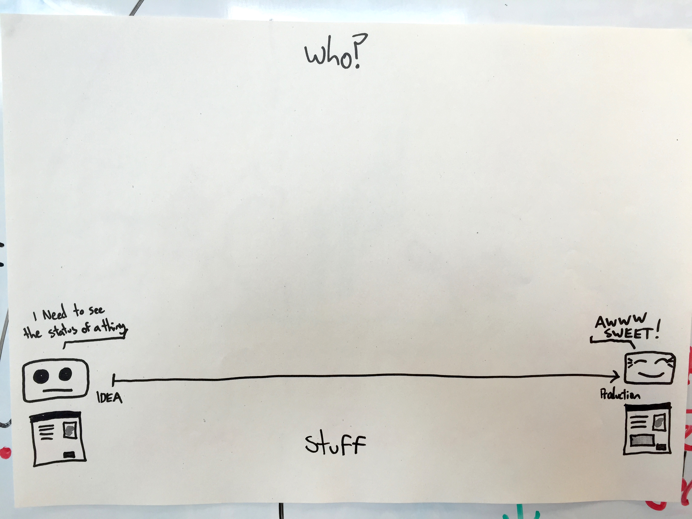
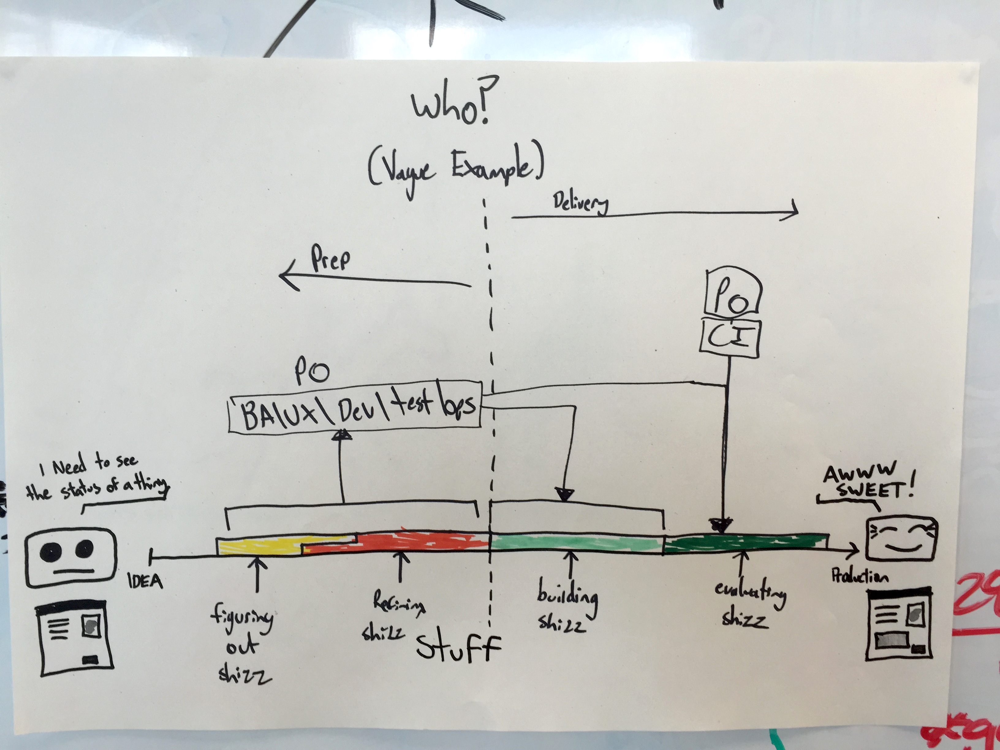
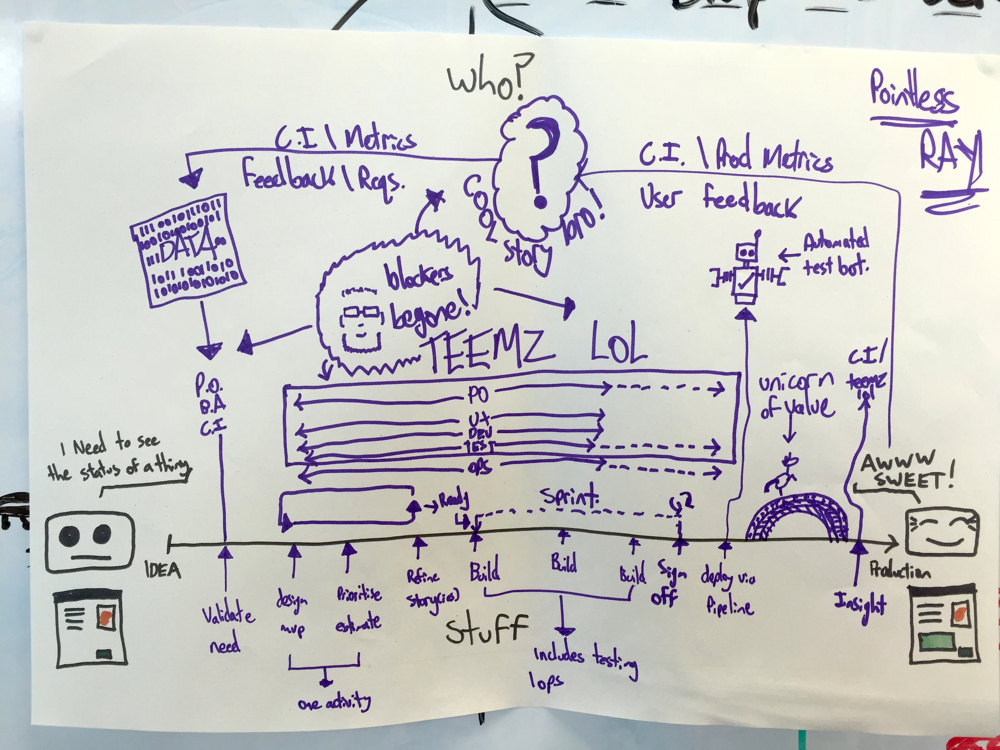

Recently the project I've been working on underwent something of a reshuffle, and a group of us found ourselves cast into a new team. Whilst this can be a bit unsettling, it's also a super good opportunity to learn a bit more about new people, about the dynamic of the group, and the understanding of how we "do things".
 
As one of the 'longer in the tooth' members of the team, I find I often make assumptions about peoples level of understanding of how we should be working as a team, it's a bad habit...usually the thought lurking at the back of my brain is "surely everyone knows this is how we would work, to do otherwise is clearly massively wrong" and therefore, those assumptions don't get tested. Which we all know is not a cool plan.

> 'Assumptions make you a total clown if you don't validate them'
>
> Vidal Sassoon ~1968

Thankfully, I've developed a good habit to counter this by not listening to the dark recesses of my brain, and challenge my own assumptions as often as I can. To that end, with the new team in place, we conducted an exercise to see just where our understanding of how we work as a team is. Whilst I won't share all of the detail of the specific results, what I can do is provide an example of the exercise, and what it was useful for achieving.

## The Setup
I'm a lo-fi sort of person for the most part when it comes to communication, so the setup for this is very simple.

It involves paper, and a pen.
 

 
Very simply, on the left we have a user that needs something, on the right, we have the user having got the thing, and is super pleased (mostly).
 
Below the line the team were asked to mark activities that they saw happening to get from User Need to User Value, and above the line indicated who it was that was involved in doing it.
 

## The point here being?
Yes, this is all rather unscientific looking and somewhat chaotic, but the point here is that it allows me to get an understanding of how the team thinks as a dev/tester/business analyst/ux designer/product owner etc. in a cross functional team, and as someone who has a deeper understanding of the good, the bad and the ugly of this way of working, I can then figure if we need to do something to change our dynamic.

## Dammit man I need results!
Results indeed.
 
As I mentioned before, the exercise itself looked like it could be chaotic and it was, thankfully everyone engaged quite fully with it, and once everyone had completed their page, we put them up on a board for everyone to review. 
 
When we discussed various peoples efforts as a group, it span off into side discussions about Ux Design, Testing, Development, Sign Off of things delivering user value, responsibilities, deployment...pretty much everything, so we needed a good moderator for the debate that followed.
 
As an exercise it was incredibly useful, the variation in opinion of how we should be working was vast, with some of the team evidently working in their own silos, some disagreeing entirely with everyone else, and violent agreement about some other aspects of how we work. It's highlighted some gaps in our ways of working with each other, and provided some great insight into things we can make much better.
 
Ultimately, for me, it challenged my assumptions, and it did the same for the team. We now know more about each other, and I am armed with useful data I can review to decide what to do next....
 
I can strongly recommend giving this a go.

### Finally
It would be bad form for me to not include my own response to this...so here you go:
