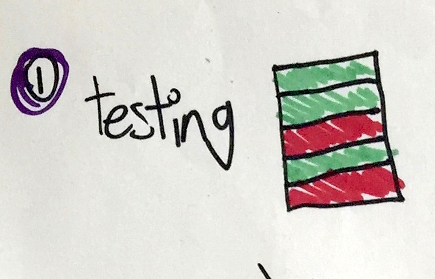
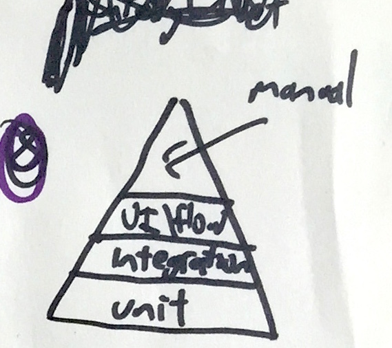

```
Status: Draft, WIP, References to be added, currently list of points to cover.
```

## Testing. Such good times.
So, i've recently been asked to talk to some trainee software engineers about testing, the guys running the course they are on are doing an excellent job covering the hows of testing, so they asked me to give a bit of an idiots guide (i.e. something I understand) to the WHY of testing.

This is the outline of my thought process for putting together a presentation on the subject.

I'll rattle through my thoughts on the subject based on the crude outline of what I'm going to talk about...

### 1. Testing

<br/>
<br/>
The art of making an automated list of your failures.

### 2. Why Bother?

<br/>
<br/>
So, an automated list of failures, that doesn't sound the best. Surely we could be spending time doing something else...

### 3. Where's my stuff?

<br/>
<br/>
...like building stuff. So much stuff. Angry customer guy wants all the stuff. Gimme it. Now.

### 4. Stuff, Ca$H, Not Terrible

<br/>
<br/>
The golden triangle of making things. Given that often we aren't doing things for free, and most projects have a budget, the Ca$h part is usually immovable, so you have a choice between the other two, lots of stuff, or stuff that is not terrible.

### 5. Pick One

<br/>
<br/>
Yup, you get to pick one. So, lets go for the lots of stuff for our money model.

### 6. Lets test that theory

<br/>
<br/>
So, cool, Planes, they have software, what if we stick loads of stuff on there, spend all our DogeCoins on features...

### 7. Uh...

<br/>
<br/>
Maybe not. Not sure about you, but personally, i'll take a plane that gets there in one piece, over a plane that has un-tested automatic ground avoidance with built in Kanye West tracking.

### 8. What sort of tests

<br/>
<br/>
So, the guys will no doubt go over this, you go from fine grained tests all the way up to pretty loose manual exploratory testing. You need this for a lot of reasons. Automated testing so you can deploy continuously...but that is a whole other topic. 

### 9. The other Pyramid

<br/>
<br/>
So, there is another test pyramid. The test pyramid of WHAT it is you are trying to prove.

### 10. Who does this?

<br/>
<br/>
So who is actually responsible for this, the old view was you have a "tester" that does this stuff.

### 11. Not sure this is a good plan

<br/>
<br/>
Maybe though, that having the people that write the code, blast it at someone who didn't to write tests for it isn't the best idea in the world.

### 12. EVERYONE DOES IT

<br/>
<br/>
Yes, thats right, it is everyone on the teams responsibility for testing. Fair enough developers may write more unit tests than others, possibly someone with more expertise might write more tests for workflow / UI. But, the role is shared.

### 13. Build the right thing
On an Agile project, the team are responsible for the design, development and deployment of functionality. Testing is part of that. Ultimately we are trying to make sure that what we are doing is building the right thing. So it goes beyond just the Mike Cohn test pyramid, it goes back to the 